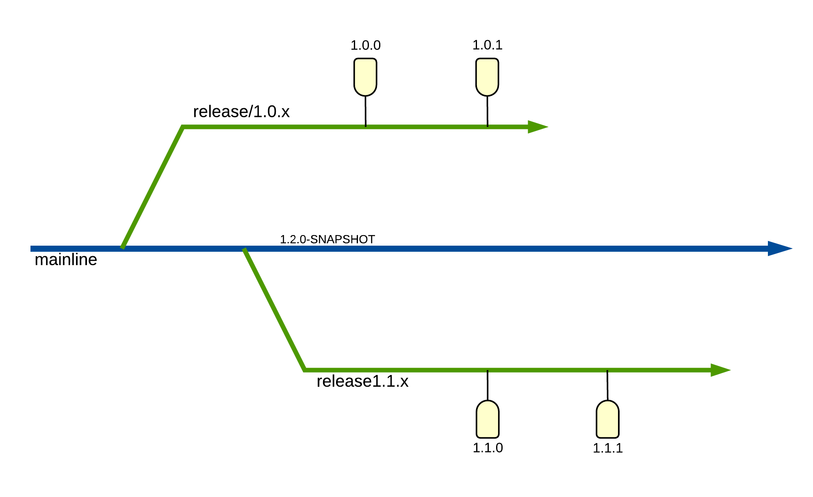

Development and Release Workflow
=====================================

This page explains the development/release workflow.

It follows the model of `Release Branching Strategy <http://releaseflow.org/>`_

   Sourced from http://releaseflow.org/

Development - Add new features
--------------------------------

In General,

- Create a feature branch from master. Call it `feature/{theme}`

- Keep making changes to the feature branch until the feature is ready. Make sure it passes all automated tests.

- Merge it to master branch after it's complete.

.. code-block:: bash

    # Git clone the repo and checkout master
    git clone -b master git@github.com:kenho811/Python_Database_Version_Control.git

    # create a feature branch from the master branch
    git checkout -b feature/{theme}

    # Pip install dependencies
    pip install with `pip install ".[dev]"`

    # Development

    # Write unit + integration tests

    # Run pytest
    pytest

    # Generate Documentation locally. ISLOCAL=1 removes local dependencies.
    cd docs
    ISLOCAL=1 make clean html

    # Open PR against master

Release - Make App available for deployment
---------------------------------------------

In General,

- Do a code-cut from the master branch.

- Name the new branch `release/{major.minor}`

- Create a tag based on the new branch `release{major.minor.patch}`

.. code-block:: bash

    # Review and merge PR into master branch

    # Update local master branch
    git checkout master
    git pull

    # Update local master branch

    # Update the tool's version under src/dvc/version.py
    # See: https://github.com/kenho811/Python_Database_Version_Control/blob/master/src/dvc/version.py#L1
    # Example: __version__ = "{major.minor.patch}"

    # Cut a release branch with the same updated version number
    git checkout -b release/{major.minor}
    git push --set-upstream origin release/{new_version_num}

    # Create a new release tag
    git tag release/{major.minor.patch}
    git push --tags

Hotfix - Fix deployment bugs
-------------------------------

In General,

- Say the release with release tag `release/0.5.0` has bugs.

- Create a new hotfix branch from the branch `release/0.5`

- After the fix is in place, merge it against `release/0.5`

- Create a new release tag based on the latest commit at `release/0.5`. Call it `release/0.5.1`.

.. code-block:: bash

    # Checkout the release branch which the problematic release tag belongs to
    git checkout release/0.5

    # Create hotfix branch
    git branch -b hotfix/against_0.5.0

    # Once done, open a PR and merge back to release/0.5

    # At release/0.5 branch, update the __version__
    # See: https://github.com/kenho811/Python_Database_Version_Control/blob/master/src/dvc/version.py#L1
    # Example: __version__ = "0.5.1"

    # Create a new release tag
    git tag release/0.5.1
    git push --tags

- The CI pipeline specified `here <ci.html>`_ will manage the rest.