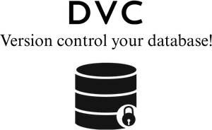

.. Database Version Control documentation master file, created by
   sphinx-quickstart on Sun Apr 24 17:21:02 2022.
   You can adapt this file completely to your liking, but it should at least
   contain the root `toctree` directive.

Welcome to Database Version Control's  documentation!
=============================================================================

.. rst-class:: center

   `DVC to version control your database!`

|badge1| |badge2| |badge3| |badge4| |badge5| |badge6| |badge7| |badge8| |badge9|

.. |badge1| image:: https://img.shields.io/github/license/kenho811/Python_Database_Version_Control?style=plastic
   :alt: License
.. |badge2| image:: https://img.shields.io/github/workflow/status/kenho811/Python_Database_Version_Control/Test
   :alt: GitHub Workflow Status
.. |badge3| image:: https://img.shields.io/readthedocs/python-database-version-control/latest?style=plastic
   :alt: Readthedocs
.. |badge4| image:: https://img.shields.io/pypi/v/database-version-control
   :alt: PyPI
.. |badge5| image:: https://img.shields.io/pypi/pyversions/database-version-control
   :alt: Python
.. |badge6| image:: https://img.shields.io/github/commit-activity/m/kenho811/Python_Database_Version_Control?style=plastic
   :alt: Commit
.. |badge7| image:: https://img.shields.io/github/last-commit/kenho811/Python_Database_Version_Control
   :alt: Last commit
.. |badge8| image:: https://img.shields.io/github/followers/kenho811?style=social
   :alt: GitHub
.. |badge9| image:: https://img.shields.io/youtube/channel/views/UC9aCwHsCO0ZewWlQy27naEA?style=social)](https://www.youtube.com/watch?v=9l3m7zBxN4Y
   :alt: Youtube

.. toctree::
   :maxdepth: 2
   :caption: Contents:
   :numbered:

   pages/introduction
   pages/feature
   pages/quickstart
   deployment/index
   design/index
   tests/index
   contribution/index
   pages/changelog

Summary
----------------
Compute (Application) and Storage (Database) are decoupled.

When you make changes to your application code, you should also mke changes to your database.
In other words, you probably want to version control both your application code and your database.
Without version controlling both, any changes in either side can cause incompatibility issues and break the entire service as a whole.

Use DVC now to version control your database!

Description
----------------

Database Version Control (DVC) is a CLI utility which version controls your database in the following ways:

- Generate metadata table(s) in your database;

- For each SQL script applied, update the metadata table(s);

- Exposes the metadata via CLI commands.

Benefits
----------------

- Rich metadata is available in the database. The database can be directly queried with SQL for both historical and current database versions.

- Only plain SQL files are accepted. No extra abstraction layer as is generally available in ORM.

More information
-------------------
.. list-table::

    * - .. figure:: _static/img/github_logo.png

            `Code on GitHub <https://github.com/kenho811/Python_Database_Version_Control>`_
      - .. figure:: _static/img/dockerhub_logo.png

            `Docker Image on Dockerhub <https://hub.docker.com/repository/docker/kenho811/database-version-control#>`_

      - .. figure:: _static/img/readthedocs_logo.png

            `Documentation on Readthedocs (latest) <https://python-database-version-control.readthedocs.io/en/latest>`_

      - .. figure:: _static/img/youtube_logo.png

            `Demo on Youtube <https://www.youtube.com/watch?v=9l3m7zBxN4Y>`_

Supported Databases
---------------------

.. list-table::

    * - .. figure:: _static/img/postgresql_logo.png

            `Postgresql <https://www.postgresql.org/>`_

