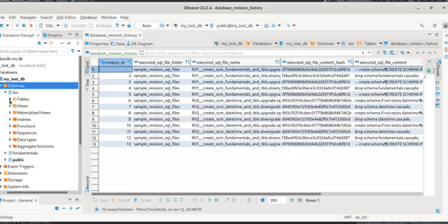
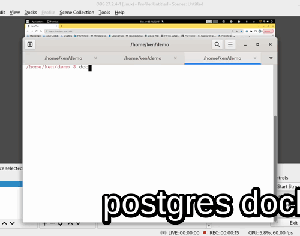
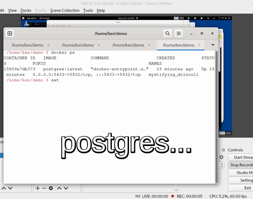

Features
============

Command Line Interface
--------------

.. image:: ../_static/gif/command_line_interface.gif
   :class: center
   :alt: Command Line Interface

Rich Database Metadata
-------------------------

Upgrade or Downgrade
----------------------

Configuration
---------------

Configuration is read either from i. Configuration File (config.yaml) or ii. Environment Variable

Configuration File
~~~~~~~~~~~~~~~~~~~~

.. note::
   The configuration file template can be generated via `dvc cfg init`

Environment Variable
~~~~~~~~~~~~~~~~~~~~~~~

.. note::
   The names of the environment variables can be found in the `docker compose file <https://github.com/kenho811/Python_Database_Version_Control/blob/master/docker-compose.yml#L21-L27>`_

